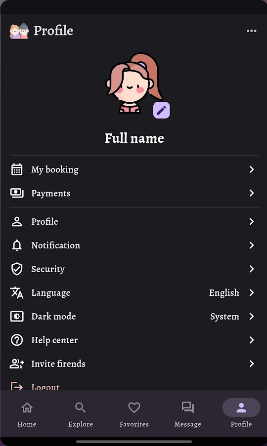
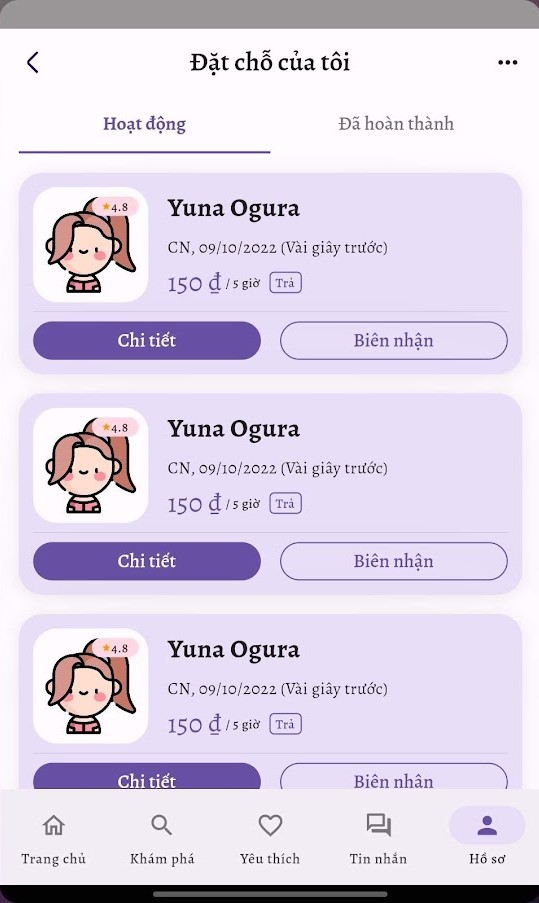
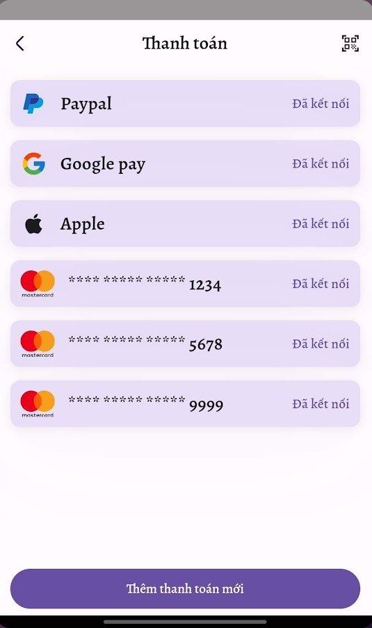
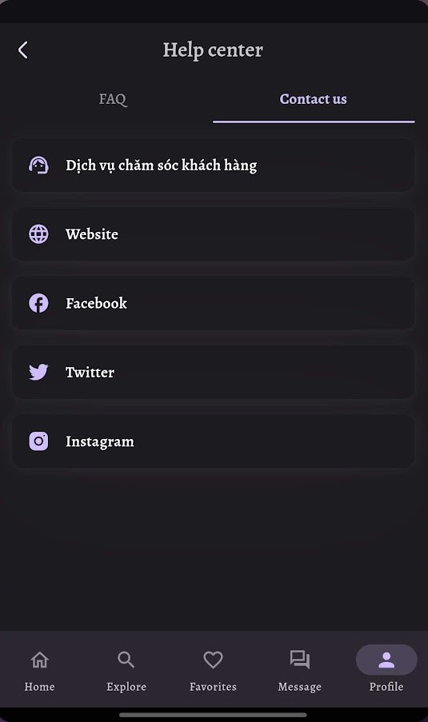
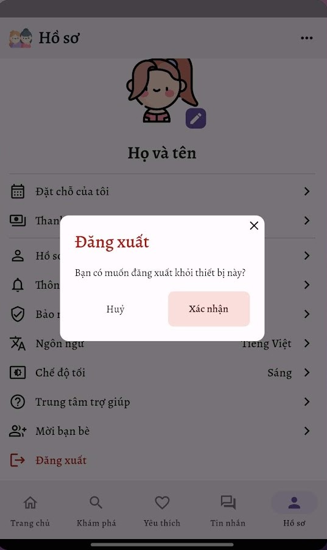

# Rental Girl Friend App - Made With Flutter

A rental app made for you.

Rental Girl Friend is an app made with **Flutter** framework to provide online rental functionality.
**The release apk is available under the release tags. It's also available on this drive link - [Rental Girl Friend APK]**

## Demo

### 1. Onboarding, Sign up & Sign in

|            Welcome Screen            |           Signup Screen            |
| :----------------------------------: | :--------------------------------: |
|        |        |
|  |  |

### 2. Account Setup

### 3. Fogot & Reset password

### 4. Home

### 5. Detail & Booking

### 6. Search

### 7. Favorites

### 8. Chat

|            Chat Screen            |            Chat Detail Screen            |              Attach Screen               |
| :-------------------------------: | :--------------------------------------: | :--------------------------------------: |
|        |        |        |
|  |  |  |

### 9. Profile

|              Profile Screen               |             My Booking Screen              |              Payments Screen               |            My Profile Screen            |
| :---------------------------------------: | :----------------------------------------: | :----------------------------------------: | :-------------------------------------: |
|             |           |             |        |
|       |     |       |  |
|            Notification Screen            |              Security Screen               |              Language Screen               |            Dark Mode Screen             |
|        |             |             |         |
|  |       |       |   |
|            Help Center Screen             |             Help Center Screen             |            Invite Friend Screen            |              Logout Screen              |
|         |        |        |            |
|   |  |  |      |

## ⭐ Future Features

-   Pending

_Feel free to fork and contribute to include these features._ ❤︎

## 🚀 Technologies

-   [Flutter v3.3.4]
-   Dart v2.18.2
-   DevTools v2.15.0

## 🤝 Contribute

To contribute, fork the repository and push the changes to the **master** branch. Then submit a pull request for merging with the source. If your code passes the review and checks it will be merged into the master branch.

## 💬 Feedback

Feel free to send us feedback on [Twitter] or [file an issue]. Feature requests are always welcome.

## 📝 License

Licensed under the [MIT License].
